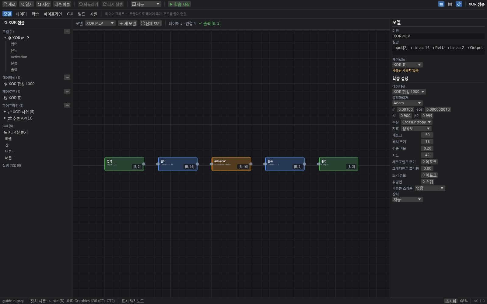
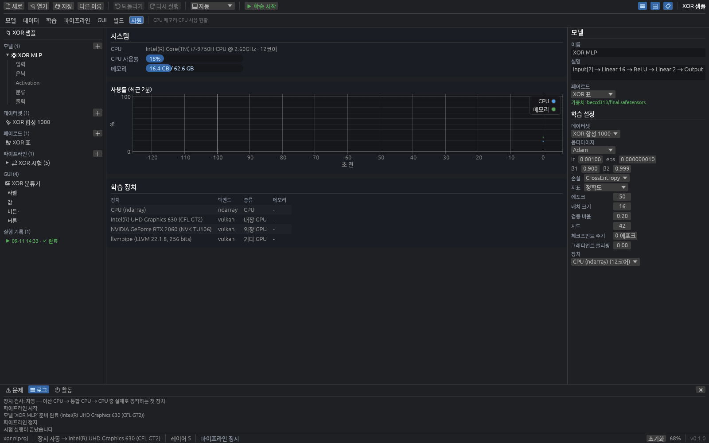
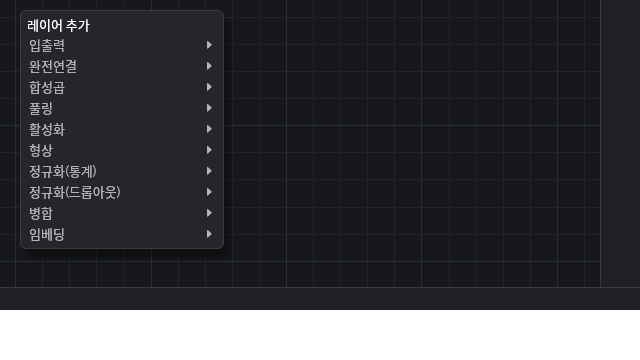
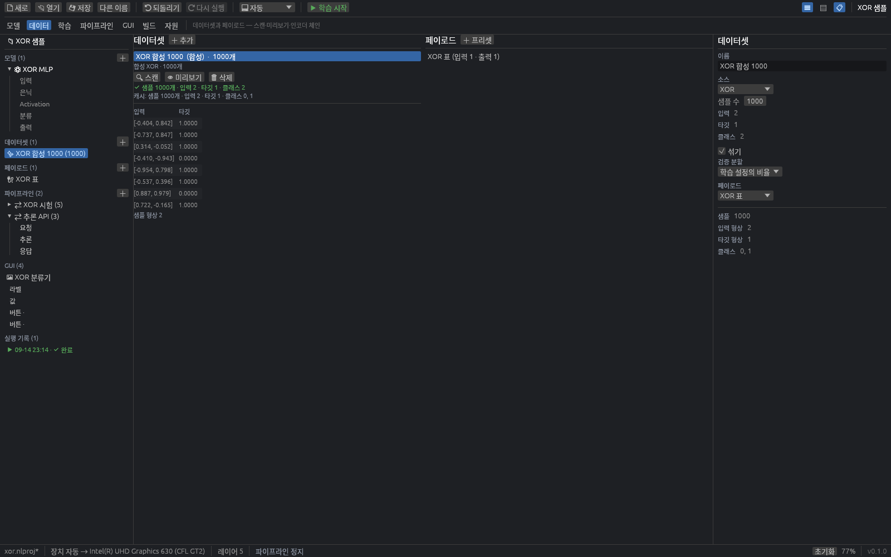
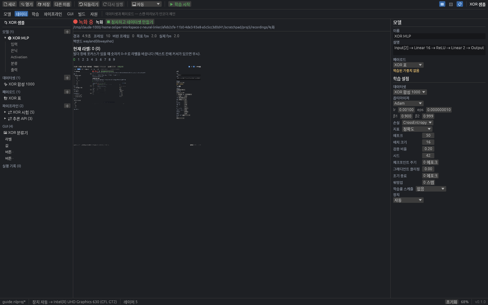
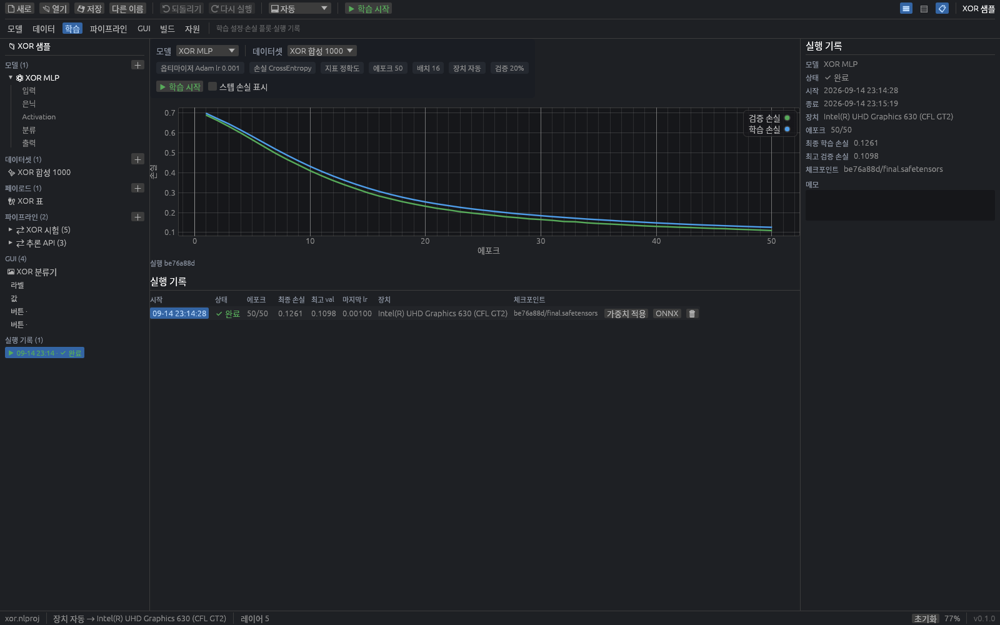
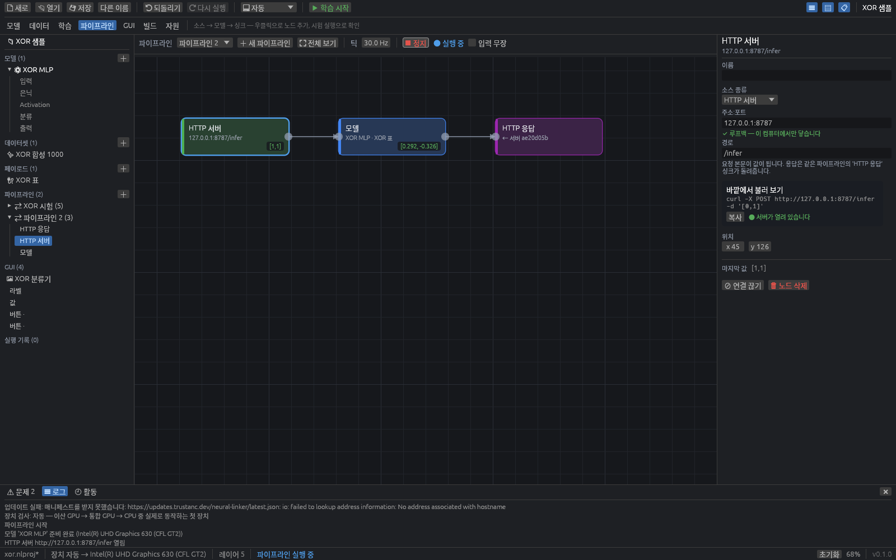
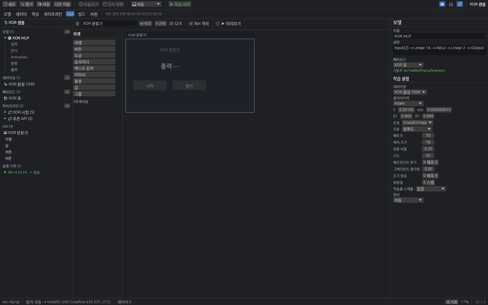
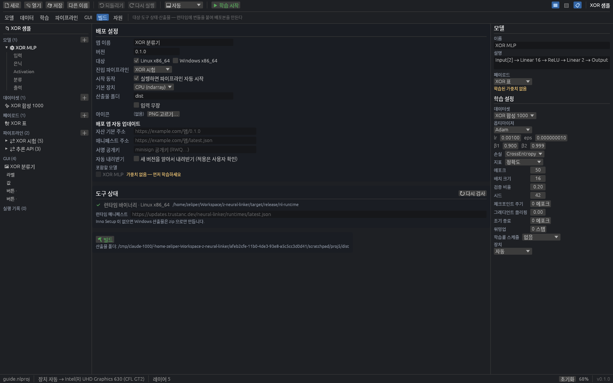
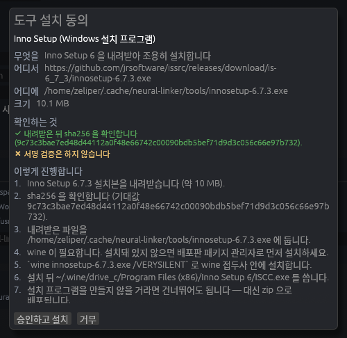

# Neural Linker 사용자 가이드

레이어를 그려 모델을 만들고, 데이터를 모으고, 학습하고, 바깥 세계와 잇고, **혼자 도는 앱으로 내보내는** 도구입니다.
파이썬도 명령줄도 없이 창 하나에서 끝납니다.

- 빌더 = `nl-app` (창이 있는 프로그램)
- 배포판 = `nl-runtime` + 여러분이 만든 번들 (사용자 PC 에 Rust 도, 파이썬도 필요 없습니다)
- 명령줄 = `nl` (스크립트와 CI 용)

---

## 목차

1. [설치](#설치)
2. [첫 실행](#첫-실행)
3. [샘플 열기](#샘플-열기)
4. [모델 캔버스](#모델-캔버스)
5. [데이터](#데이터)
6. [페이로드](#페이로드)
7. [학습](#학습)
8. [파이프라인](#파이프라인)
9. [GUI 디자이너](#gui-디자이너)
10. [빌드](#빌드)
11. [배포판 실행](#배포판-실행)
12. [명령줄 `nl`](#명령줄-nl)
13. [자동 저장과 복구](#자동-저장과-복구)
14. [문제 해결](#문제-해결)

---

## 설치

### Linux

```sh
tar -xzf neural-linker-<버전>-linux-x86_64.tar.gz
cd neural-linker
./install.sh                 # ~/.local 아래에 설치 (관리자 권한 필요 없음)
./install.sh --uninstall     # 제거
```

`~/.local/bin/nl-app` 과 데스크톱 항목, `.nlproj` 파일 연결이 들어갑니다. 아카이브에 `nl-runtime` 이 같이 있으면
그것도 `~/.local/bin` 에 놓습니다 — 빌드할 때 빌더가 바로 찾습니다. `$PATH` 에 `~/.local/bin` 이 있어야 터미널에서
바로 실행됩니다.

풀어서 바로 써도 됩니다. 설치 없이 `./nl-app` 을 실행하면 그대로 뜹니다.

**필요한 시스템 라이브러리는 `libxkbcommon.so.0` 하나뿐**이고 모든 데스크톱 Linux 에 기본으로 들어 있습니다
(Fedora `libxkbcommon`, Debian/Ubuntu `libxkbcommon0`). **개발 패키지는 필요 없습니다.**

### Windows

```
neural-linker-<버전>-windows-x86_64.zip 을 풀고 nl-app.exe 를 실행합니다.
```

설치 프로그램 없이 폴더째 옮겨도 그대로 동작합니다.

---

## 첫 실행



창이 뜨면 왼쪽부터 **아웃라인**(프로젝트 트리), 가운데 **뷰**, 오른쪽 **인스펙터**입니다. 맨 위가 툴바,
그 아래가 뷰 바, 맨 아래가 상태바입니다.

### 뷰 전환

| 뷰 | 단축키 | 하는 일 |
| --- | --- | --- |
| 모델 | `Ctrl+1` | 레이어 그래프 |
| 데이터 | `Ctrl+2` | 데이터셋과 페이로드 |
| 학습 | `Ctrl+3` | 학습 설정·손실 플롯·실행 기록 |
| 파이프라인 | `Ctrl+4` | 소스 → 모델 → 싱크 |
| GUI | `Ctrl+5` | 배포 앱의 위젯 배치 |
| 빌드 | `Ctrl+6` | 대상·도구 상태·산출물 |
| 자원 | `Ctrl+7` | CPU·메모리·GPU 사용 현황 |

그 밖의 단축키: `Ctrl+S` 저장, `Ctrl+Shift+S` 다른 이름, `Ctrl+O` 열기, `Ctrl+N` 새 프로젝트,
`Ctrl+Z` 되돌리기, `Ctrl+Shift+Z` 다시 실행, `Ctrl+B` 아웃라인, `Ctrl+Alt+B` 인스펙터, `Ctrl+J` 하단 도크.
캔버스에서는 `F` 전체 보기, `Ctrl+A` 전체 선택, `Ctrl+D` 복제, `Del` 삭제.

이름이나 숫자를 고치는 중에도 `Ctrl+S`·`Ctrl+O`·`Ctrl+N`·뷰 전환·패널 토글은 그대로 먹습니다.
`Ctrl+A`·`Ctrl+Z`·`Del`·`Esc` 는 텍스트 칸이 가져갑니다 — 편집 중이라면 글자에 대한 동작입니다.

### 장치 확인

툴바의 `🖳` 콤보가 학습·추론에 쓸 장치입니다. 기본은 **자동**입니다.

자동은 **이산 GPU → 통합 GPU → CPU** 순으로 훑되, 그냥 목록에서 고르는 것이 아니라 **실제로 작은 연산을
한 번 돌려 보고**(64×64 행렬곱 → ReLU → 역전파 → CPU 로 읽어오기) 통과한 첫 장치를 씁니다. 드라이버가
깨진 GPU 는 건너뜁니다. 소프트웨어 래스터라이저는 CPU 보다 느려 후보에서 빠집니다.

하단 도크의 로그에 결과가 남습니다.

```
자동 장치 선택: NVIDIA GeForce RTX 2060 (NVK TU106) 를 건너뜁니다 — 패닉: …
자동 장치 선택: Intel(R) UHD Graphics 630 (CFL GT2) 검사 통과 (812 ms)
```

**첫 자동 선택은 수 초에서 수십 초 걸릴 수 있습니다.** GPU 셰이더를 처음 컴파일하기 때문이고, 그 뒤로는
캐시됩니다. 확인은 백그라운드에서 하므로 **창은 곧바로 뜨고 그동안에도 클릭과 단축키가 먹습니다.**
그 사이 상태바에는 `확인 중…` 이 보이다가 끝나면 실제 장치 이름으로 바뀝니다.

콤보에서 직접 고른 장치는 **검사 없이 그대로 씁니다.** 자동이 마음에 들지 않으면 `CPU (ndarray)` 나
통합 GPU 를 직접 고르세요. 없는 GPU 번호를 고르면 CPU 로 떨어집니다.



자원 뷰(`Ctrl+7`)의 **학습 장치** 표에서 이 컴퓨터가 가진 장치를 전부 볼 수 있습니다. `종류` 열이
`외장 GPU` / `내장 GPU` / `기타 GPU` / `CPU` 입니다. `기타 GPU` 는 대개 소프트웨어 래스터라이저(llvmpipe)라
자동 선택에서 빠집니다.

자원 뷰 아래쪽에는 **자동 저장 · 복구** 와 **빌더 업데이트** 구역이 있습니다. 빌더 자신의 업데이트는
서명 공개키가 빌드에 들어 있을 때만 켜집니다. 없으면 `서명 키 미설정 — 업데이트 비활성` 이 보이고 확인
자체를 하지 않습니다. 검증할 수 없는 업데이트를 받는 것보다 안 받는 편이 안전하기 때문입니다.

> **NVK 같은 오픈소스 드라이버**: 이 개발 PC 의 RTX 2060 은 NVK 드라이버라 wgpu 컴퓨트가 죽습니다.
> 자동 선택이 걸러 내고 Intel UHD 630 을 고릅니다. NVIDIA 공식 드라이버를 깔면 RTX 로 잡힙니다.
> 걸러지는 동안 터미널에 드라이버가 남기는 패닉 메시지가 그대로 보이는데, 원인 파악에 필요해서 숨기지
> 않은 것입니다.

---

## 샘플 열기

`📂 열기` → `샘플` 에 두 개가 있습니다.

- **XOR 분류 (MLP)** — `Input[2] → Linear 16 → ReLU → Linear 2 → Output`. 합성 데이터 1000개,
  학습 50 에포크가 몇 초에 끝납니다. 파이프라인과 GUI 까지 붙어 있어 전 과정을 볼 수 있습니다.
- **사분면 분류 (CNN)** — 이미지 입력 예제.

처음 실행하면 XOR 샘플이 자동으로 열립니다. 프로젝트 파일 확장자는 `.nlproj` 이고 내용은 JSON 입니다.

---

## 모델 캔버스

`Ctrl+1`. 빈 곳을 **우클릭**하면 레이어 팔레트가 나옵니다.



분류는 **입출력 → 완전연결 → 합성곱 → 풀링 → 활성화 → 형상 → 정규화(통계) → 정규화(드롭아웃) → 병합 → 임베딩**
순입니다. 항목에는 기본 설정이 함께 보입니다 — `Linear  → 64`, `Conv2d  16ch k3×3 s1×1 p1×1` 처럼요.

### 연결

- 출력 포트는 노드 **오른쪽 변 가운데**, 입력 포트는 **왼쪽 변**에 슬롯 수만큼 나뉘어 있습니다.
- 출력 포트에서 끌어 입력 포트에 놓습니다. **노드 몸통에 놓아도** 비어 있는 첫 슬롯으로 들어갑니다.
- 이미 꽂힌 입력 포트에서 끌면 그 연결을 **떼어 옮깁니다.**
- 끄는 동안 선 색이 알려 줍니다: 초록이면 연결됨, 빨강이면 거부, 파랑이면 아직 대상이 없음.
  거부 사유가 빨간 알약으로 붙습니다 — `순환 연결`, `이미 연결된 슬롯`, `입력 슬롯 없음` 등.

### 형상 라벨과 오류

노드 오른쪽 아래 알약이 그 레이어의 **출력 형상**입니다. 배치 차원은 `B` 로 나와 `[B, 16]` 처럼 보입니다.
추론할 수 없으면 `?`, 오류가 있으면 `오류` 와 함께 빨간 테두리가 붙고 마우스를 올리면 이유가 뜹니다.

상단 요약 줄에 `레이어 5 · 연결 4 · ✔ 출력 [B, 2]` 처럼 나옵니다. 오류가 있으면 `✖ 오류 3개` 로 바뀌고,
하단 도크의 **문제** 탭(`Ctrl+J`)에서 항목을 누르면 그 노드로 이동합니다.

### 편집

| 조작 | 하는 일 |
| --- | --- |
| 좌드래그(노드) | 이동. 여러 개 선택했으면 함께 움직이고 되돌리기도 한 번 |
| 좌/중드래그(배경) | 화면 이동 |
| 휠 / `Ctrl`+휠 | 스크롤 / 줌 (0.15~3.0배) |
| `Alt`+드래그 | 사각형 선택 |
| `Shift` 또는 `Ctrl`+클릭 | 선택 토글 |
| `Ctrl+D` | 복제 (선택 안쪽 연결도 함께) |
| `Del` | 삭제 |
| `F` | 전체 보기 |

노드를 우클릭하면 `⎘ 복제`, `⊘ 연결 끊기`, `🗑 삭제` 가 나옵니다.

레이어 설정은 오른쪽 인스펙터에서 고칩니다. 형상은 `3×28×28` 처럼 `×` 로 잇고, `x`·`,`·`*`·공백도 받습니다.

---

## 데이터

`Ctrl+2`. 왼쪽이 데이터셋, 오른쪽이 페이로드입니다.



### 데이터셋 만들기

`＋ 추가` 메뉴:

- **합성 (바로 학습 가능)** — `XOR`, `두 나선`, `선형 회귀`, `사분면 이미지`. 1000샘플이 바로 만들어집니다.
- **CSV 파일…** — 열을 보고 입력/타깃을 고릅니다. 첫 줄이 헤더인지 체크박스로 정하고, 기본으로 마지막 열이
  타깃으로 잡힙니다.
- **이미지 폴더…** — **하위 폴더 이름이 클래스가 됩니다.**
- **녹화 폴더…** — 이미 찍어 둔 폴더를 가져옵니다.
- **⏺ 녹화 데이터셋 만들기…** — 아래 참고.

만든 뒤 `🔍 스캔` 을 누르면 샘플 수·형상·클래스를 알아내 캐시에 적습니다.
`✔ 샘플 85 · 입력 3×1000×1600 · 타깃 1 · 클래스 4` 처럼 나옵니다. `👁 미리보기` 는 앞에서 8개를 보여 줍니다.

한 장도 없는 클래스가 있으면 캐시 줄 아래에 `⚠` 경고가 붙습니다. 녹화 중에 라벨 키를 건너뛰었거나
이미지 폴더 하나가 비어 있다는 뜻입니다. 그대로 학습하면 그 클래스는 영영 예측되지 않습니다.

### 화면 녹화



`＋ 추가` → `⏺ 녹화 데이터셋 만들기…` 로 폼을 엽니다.

| 항목 | 기본값 |
| --- | --- |
| 이름 | `녹화` |
| 폴더 | `<프로젝트 폴더>/recordings/<이름>` |
| 초당 프레임 | **2.0** (범위 0.2~60) |
| 캡처 영역 | 모니터 0 전체 |

`📷 지금 한 장 캡처` 로 영역과 백엔드를 먼저 확인하세요. 백엔드 이름이 초록으로 뜹니다.

**라벨 키**: 0~9 칸에 이름을 적어 둡니다. 비워 둬도 됩니다. 녹화 중 **빌더 창에 포커스가 있을 때 숫자키를
누르면 그때부터 그 라벨로 기록**됩니다. 텍스트 칸에 커서가 있으면 무시합니다.

녹화 중 화면에는 경과·프레임·버린 프레임·목표 fps·실제 fps 와 현재 라벨이 보입니다.
`⏹ 정지하고 데이터셋 만들기` 를 누르면 데이터셋이 생깁니다.

저장 형식:

```
<폴더>/
  frames/000001.png  000002.png  …    ← RGBA 캡처를 PNG 로 (6자리, 저장된 순서)
  labels.jsonl                        ← {"frame":"000001.png","label":3,"t_ms":1234}
  meta.json                           ← 영역·fps·시작 시각·백엔드
```

같은 폴더에 두 번 녹화하면 프레임 번호가 겹쳐 섞이므로 **이어 쓰지 않고 덮어씁니다.**

> **fps 가 안 나올 때**: GNOME·KDE 는 `xdg-desktop-portal` 을 거치는데 한 장씩 PNG 로 받아 오는 방식이라
> **초당 1~3장이 한계**입니다. 그래서 기본값이 2.0 입니다. Sway·Hyprland 나 X11 세션은 초당 수십 장까지
> 나옵니다. 캡처가 따라오지 못하면 `버린 프레임` 이 올라갑니다.

---

## 페이로드

데이터 뷰 오른쪽. **모델 입출력과 바깥 데이터를 잇는 계약**입니다. 이미지를 텐서로 바꾸고, 로짓을 클래스
이름으로 되돌리는 변환 체인을 여기서 정합니다.

`＋ 프리셋` 에 `이미지 분류 (28×28 → 클래스)`, `표 데이터 (벡터 → 벡터)`, `빈 페이로드` 가 있습니다.

필드 종류는 `텐서`, `이미지`, `스칼라`, `벡터`, `클래스 라벨`, `텍스트`, `JSON` 입니다.
각 필드에 **인코드 (바깥 → 텐서)** 와 **디코드 (텐서 → 바깥)** 체인을 답니다.

변환 11종: `크기 변경`, `흑백`, `잘라내기`, `정규화`, `범위 변환`, `원핫`, `argmax`, `softmax`, `임계값`,
`라벨 이름`, `JSON 포인터`.

---

## 학습

`Ctrl+3`.



### 설정

모델과 데이터셋을 고르면 설정 칩이 요약을 보여 줍니다. 값은 오른쪽 인스펙터에서 고칩니다.

| 항목 | 기본값 | 비고 |
| --- | --- | --- |
| 옵티마이저 | `Adam` (lr 0.001, β1 0.9, β2 0.999, eps 1e-8) | `SGD`(lr 0.01, 모멘텀 0.9), `AdamW`(+ 가중치 감쇠 0.01) |
| 손실 | `CrossEntropy` | `MSE`, `BCE (logits)`, `MAE` |
| 지표 | `정확도` | `MAE`, `없음` |
| 에포크 | `10` | |
| 배치 크기 | `32` | |
| 검증 비율 | `0.2` | 데이터 뒤쪽에서 잘라 씁니다 |
| 시드 | `42` | |
| 체크포인트 주기 | `0` | 0 이면 마지막만 |
| 그래디언트 클리핑 | `0.0` | 0 이면 없음 |
| 조기 종료 | `0 에포크` | 검증 손실이 이만큼 나아지지 않으면 멈춥니다. 0 이면 끄기 |
| 워밍업 | `0 스텝` | 처음 이만큼 학습률을 0 에서 기본값까지 올립니다 |
| 학습률 스케줄 | `없음` | 아래 표 참고 |

#### 학습률 스케줄

종류를 고르면 그 종류의 값만 나옵니다. 종류를 바꾸면 기본값에서 다시 시작합니다 — 스케줄마다 숫자의
뜻이 달라 이어 가면 오히려 헷갈리기 때문입니다.

| 종류 | 값 | 하는 일 |
| --- | --- | --- |
| `없음` | | 학습률이 그대로입니다 |
| `단계 감쇠` | 주기 `10 에포크`, 감쇠율 `0.5` | 주기마다 학습률에 감쇠율을 곱합니다 |
| `코사인` | 최저 학습률 `0.000010` | 전체 에포크에 걸쳐 코사인 모양으로 내려갑니다 |
| `정체 시 감쇠` | 기다릴 에포크 `5`, 감쇠율 `0.5` | 검증 손실이 나아지지 않으면 낮춥니다. **검증 집합이 있어야 합니다** |

스케줄을 켜면 손실 곡선 아래에 **학습률 곡선**이 따로 그려집니다. 손실과 자릿수가 달라(1e-3 대 1) 같은
축에 겹치면 한쪽이 납작해지기 때문에 나눠 그립니다. 실행 기록 표에도 `마지막 lr` 열이 생깁니다.

### 실행

`▶ 학습 시작`. 진행 중에는 `⏸ 일시정지` 와 `⏹ 정지` 가 나옵니다.

시작하려면 **프로젝트가 저장돼 있어야 합니다** — 실행 기록과 체크포인트를 둘 폴더가 필요하기 때문입니다.
형상 오류가 있으면 시작하지 않고 문제 탭을 열어 줍니다.

진행 줄에 `에포크 51/50`, `학습 손실 0.1328`, `검증 손실 0.1193`, `정확도 0.9800` 이 나오고 아래 플롯에
**학습 손실**(파랑)과 **검증 손실**(초록)이 그려집니다. `스텝 손실 표시` 를 켜면 배치 단위 손실도 얇은 회색으로
겹쳐집니다.

### 실행 기록

`시작`·`상태`·`에포크`·`최종 손실`·`최고 val`·`마지막 lr`·`장치`·`체크포인트` 열이 있습니다. 행을 누르면
그 실행의 곡선이 그려집니다.

**`가중치 적용`** 버튼이 그 실행의 체크포인트를 모델 가중치로 삼습니다. 정상적으로 끝난 학습은 자동으로
적용되므로, 이 버튼은 중간 실행으로 되돌릴 때 씁니다.

조기 종료를 켜서 학습한 실행에는 **검증 손실이 가장 낮았던 에포크의 가중치**가 따로 남습니다. 그때는
체크포인트 열에 `(최고)` 가 붙고 `가중치 적용` 이 마지막이 아니라 그것을 씁니다. 마지막 에포크가 이미
과적합으로 넘어간 뒤일 수 있기 때문입니다.

체크포인트는 safetensors 로 `<프로젝트이름>.runs/<실행id>/` 아래에 `final.safetensors` 와
(주기를 정했으면) `epoch-0005.safetensors` 처럼 저장됩니다.

---

## 파이프라인

`Ctrl+4`. **소스 → 모델/로직 → 싱크** 로 바깥 세계와 모델을 잇습니다.



빈 곳을 우클릭하면 `소스`·`모델`·`로직`·`싱크` 서브메뉴가 나옵니다. 연결은 포트가 아니라 **노드 → 노드**입니다.

### 소스 9종

| 이름 | 기본값 |
| --- | --- |
| 수동 입력 | 인스펙터에서 값을 직접 보냅니다 |
| 타이머 | 1000 ms 마다 0부터 증가하는 숫자 |
| 화면 캡처 | 모니터 0 전체, 5 fps |
| HTTP 폴링 | `https://example.com/api`, 1000 ms |
| WebSocket 수신 | `wss://example.com/ws` |
| stdin JSON | 한 줄 = JSON 하나 |
| 파일 | `input.json`, 1000 ms 마다 다시 읽음 |
| GUI 이벤트 | 위젯을 고르면 그 이벤트를 받습니다 |
| HTTP 서버 | **`127.0.0.1:8787`**, 경로 **`/infer`**, 토큰(선택) |

### 로직 5종 · 싱크 8종

로직: `임계값`(≥ 0.5), `디바운스`(200 ms), `선택`(index 0), `치환`(정수 표), `다수결`(최근 5개).

싱크: `로그`, `stdout JSON`, `GUI 위젯`, `파일 쓰기`, `HTTP 호출`, `WebSocket 송신`, `마우스/키보드`, `HTTP 응답`.

### 시험 실행

`▶ 시험 실행` 을 누르면 하단 도크가 열리고 로그 탭으로 바뀝니다. 실행 중에는 노드마다 마지막 값이 초록
알약으로 붙고, 오류는 오른쪽 위 빨간 점으로 표시됩니다.

`틱` 은 소스가 시간 기반이 아닐 때의 최대 속도입니다. 기본 30 Hz, 범위 0.05~240 Hz.

상태바에 실제 속도가 `30.0 Hz · 0.4 ms` 로 나옵니다.

### 입력 무장과 Esc 킬 스위치

`마우스/키보드` 싱크는 진짜로 커서를 움직이고 키를 누릅니다. 그래서 **기본은 꺼져 있습니다.** 꺼져 있으면
액션을 로그로만 남깁니다.

`입력 무장` 체크박스를 켜야 실제 입력이 나갑니다. 켜져 있으면 옆에 `⚠ 실제 입력` 이, 상태바에 `⚠ 입력 무장`
이 뜹니다. 실행 중에 토글하면 **다음 시험 실행부터** 적용됩니다.

> **Esc 를 0.5초 길게 누르면 즉시 멈춥니다.** 텍스트 칸에 커서가 있어도, 모달이 떠 있어도 먹습니다.
> 커서가 제멋대로 움직여 마우스를 쓸 수 없게 되어도 이걸로 빠져나올 수 있습니다.
> 멈추면 `킬 스위치 — 파이프라인을 멈췄습니다` 토스트가 뜹니다.
>
> **킬 스위치는 빌더에만 있습니다.** 배포판(`nl-runtime`)에는 없습니다. 대신 배포판은 **기본적으로
> 무장하지 않습니다** — 아래 참고.

### 배포 앱의 입력 무장

만들어진 앱도 기본은 **꺼짐**입니다. `마우스/키보드` 싱크가 들어 있어도 로그만 남기고 실제 입력은
보내지 않습니다. 받은 사람이 모르는 사이 커서가 움직이는 일이 없도록, 빌더에서 **명시적으로 켜야** 합니다.

- 빌드 설정 › **입력 무장** 체크박스 (기본 꺼짐)
- 또는 명령줄: `nl build p.nlproj --arm-input`

켜고 빌드하면 번들 매니페스트의 `arm_input` 이 참이 되고, 앱 쪽에서 이렇게 드러납니다.

- 상단 바에 `⚠ 입력 무장` 배지 (마우스를 올리면 설명이 뜹니다)
- 파이프라인을 **처음 시작할 때 한 번** 로그에 안내:
  `이 앱은 마우스·키보드를 실제로 조작합니다 (빌드할 때 입력 무장을 켰습니다).`

배포판에는 Esc 킬 스위치가 없으므로, 무장한 앱을 배포할 때는 **GUI 에 정지 버튼을 꼭 넣으세요**
(위젯 바인딩의 `내장 동작` › `파이프라인 정지`).

### HTTP 서버 노드

`HTTP 서버` 소스와 `HTTP 응답` 싱크를 짝지으면 파이프라인이 **추론 API** 가 됩니다. 배포한 앱을 다른
프로그램이 불러 쓸 수 있게 하는 입구입니다.

인스펙터에서 주소를 확인하세요. `127.0.0.1` 이면 `✔ 루프백 — 이 컴퓨터에서만 닿습니다`,
바깥에 열린 주소면 `⚠ 바깥에서 닿을 수 있는 주소입니다 — 방화벽을 확인하세요` 가 뜹니다.

#### 누가 부를 수 있나

이 입구는 파이프라인을 **구동합니다.** `마우스/키보드` 싱크가 붙어 있으면 요청 하나가 컴퓨터를
움직입니다. 그래서 두 가지 규칙이 있습니다.

| 주소 | 토큰 | 결과 |
| --- | --- | --- |
| `127.0.0.1`·`localhost`·`::1` | 없음 | 열립니다 (이 컴퓨터에서만 닿습니다) |
| `127.0.0.1` 등 | 있음 | 열립니다. 토큰이 맞아야 답합니다 |
| `0.0.0.0`·`192.168.x.x` 등 | 없음 | **실행을 거부합니다** |
| `0.0.0.0` 등 | 있음 | 열립니다 |

토큰은 노드 인스펙터의 **토큰** 칸에서 다룹니다. 팔레트로 새로 만든 서버 노드에는 토큰이 **이미 채워져
있습니다** — 나중에 바깥 주소로 바꿔도 인증 없이 열리는 일이 없게 하려는 것입니다.

| 버튼 | 하는 일 |
| --- | --- |
| `보기` / `숨기기` | 칸에 점으로 가려진 토큰을 잠깐 드러냅니다 |
| `새로 만들기` | 무작위 토큰(32자)을 만들어 채웁니다 |
| `비우기` | 토큰을 지웁니다. 루프백에 묶은 서버만 이렇게 열 수 있습니다 |

바깥에서 닿는 주소인데 토큰이 비어 있으면 그 자리에서 붉게 경고하고, 검증도 오류로 잡아 **빌드가
막힙니다.** 토큰이 있으면 아래 `바깥에서 불러 보기` 의 curl 예시에도 헤더가 함께 들어갑니다.

요청에는 둘 중 아무 헤더나 붙이면 됩니다.

```sh
curl -H 'X-NL-Token: 토큰' -d '[0,1]' http://127.0.0.1:8787/infer
curl -H 'Authorization: Bearer 토큰' -d '[0,1]' http://127.0.0.1:8787/infer
```

브라우저에서 온 요청은 **토큰이 맞아도 받지 않습니다.** `Origin` 헤더가 있으면 403 입니다. 웹페이지가
몰래 내 컴퓨터의 API 를 두드리는 길을 막기 위해서입니다. `Host` 가 서버 주소와 다르면 400 입니다.

#### 배포판에서 토큰 바꾸기

번들에 박힌 토큰은 앱을 받은 사람이 모두 볼 수 있습니다. 서버로 돌릴 때는 실행 환경에서 새로 주세요.

```sh
NL_HTTP_TOKEN=$(head -c24 /dev/urandom | base64 | tr '+/' '-_') ./내앱 --headless
NL_HTTP_TOKEN_8787=포트별토큰 ./내앱 --headless     # 이쪽이 우선합니다
```

#### 보내는 값

`Content-Type` 을 보고 본문을 값으로 바꿉니다.

| Content-Type | 값이 되는 것 |
| --- | --- |
| `image/png`·`image/jpeg` | 이미지 (디코드해서 넘깁니다) |
| `multipart/form-data` | 첫 파일 파트를 같은 규칙으로 |
| `application/json`·`text/*` 등 | JSON 이면 JSON, 아니면 텍스트 |
| (본문 없음) | 쿼리스트링이 JSON 객체로 (`?a=1&b=hi` → `{"a":"1","b":"hi"}`) |
| `application/octet-stream` | 받지 않습니다 (400) |

```sh
# 숫자 벡터
curl -d '[0.8,-0.8]' http://127.0.0.1:8787/infer

# 이진 이미지
curl --data-binary @a.png -H 'Content-Type: image/png' http://127.0.0.1:8787/infer

# 폼 업로드 (첫 파일 파트를 씁니다)
curl -F 'file=@a.png' http://127.0.0.1:8787/infer

# 이미지 입력에 JSON 을 쓸 수도 있습니다 — 픽셀 배열([채널][높이][너비])이나 base64 문자열
curl -d '[[[0.1,0.2],[0.3,0.4]]]' http://127.0.0.1:8787/infer
curl -d '"data:image/png;base64,iVBORw0KGgo…"' http://127.0.0.1:8787/infer
```

돌아오는 쪽도 값에 맞춥니다. `HTTP 응답` 싱크에 이미지가 그대로 오면 `image/png` 로, 로직을 거쳐
숫자가 됐으면 `application/json` 으로 답합니다.

#### 응답 코드

| 코드 | 뜻 |
| --- | --- |
| 200 | 정상. 파이프라인이 낸 값입니다 |
| 400 | 본문을 읽을 수 없거나 `Host` 가 서버 주소와 다릅니다 |
| 401 | 토큰이 없거나 틀립니다 |
| 403 | 브라우저에서 온 요청입니다 (`Origin` 헤더가 있습니다) |
| 404 | 이 서버가 받는 경로가 아닙니다 |
| 405 | `GET`·`POST`·`PUT`·`PATCH` 만 받습니다 |
| 411 | 본문이 있는 요청에 `Content-Length` 가 없습니다 |
| 413 | 본문이 8 MiB 를 넘습니다 |
| 431 | 헤더가 16 KiB 또는 64개를 넘습니다 |
| 503 | 모델을 올리는 중이거나, 연결·큐가 가득 찼습니다. 잠시 뒤 다시 부르세요 |
| 504 | 파이프라인이 10초 안에 응답을 내지 않았습니다 (`HTTP 응답` 싱크가 연결돼 있는지 확인하세요) |

#### 한계

- **요청은 한 번에 하나씩** 처리합니다. 도착 순서대로 한 틱에 하나씩 돌므로 `틱` 속도가 곧 초당
  처리량의 상한입니다. 기본 30 Hz 면 초당 30건입니다.
- 본문 8 MiB, 헤더 16 KiB·64개, 동시 연결 64개.
- 머리를 다 보내기까지 5초, 본문 30초, 응답까지 10초가 상한입니다. 넘으면 끊습니다.
- **keep-alive 가 없습니다.** 요청마다 연결을 새로 엽니다.
- 클라이언트 인증서(mTLS)는 받지 않습니다. 누가 부르는지는 토큰으로 가립니다.

#### HTTPS

인증서를 주면 같은 노드가 https 로 열립니다. 리버스 프록시 없이도 바깥에 낼 수 있습니다.

프로젝트 파일의 `HTTP 서버` 소스에 `tls` 를 적습니다. 두 값 모두 **PEM 파일의 경로**입니다.
명령줄에서는 파일을 고치지 않고 `nl run --tls-cert/--tls-key` 로 붙일 수도 있습니다
(아래 [명령줄 `nl`](#명령줄-nl) 참고).

시험용 자체 서명 인증서는 `nl tls-cert <폴더>` 가 만들어 줍니다(`<폴더>/certs/` 에 놓입니다).
직접 만들려면:

```sh
openssl req -x509 -newkey rsa:2048 -nodes -days 365 \
  -keyout certs/server.key -out certs/server.crt \
  -subj '/CN=localhost' -addext 'subjectAltName=DNS:localhost,IP:127.0.0.1'
```

인증서 사슬은 서버 인증서를 맨 앞에 두고 중간 인증서를 뒤에 잇습니다. 키는 PKCS#8·PKCS#1·SEC1
중 무엇이어도 됩니다.

##### 인증서를 어디에 두는가

경로는 **상대 경로**이고, 실행기가 두 곳을 순서대로 찾습니다. 어느 쪽이든 그 폴더 밖은 열어 주지
않습니다 — `../../etc/ssl/private/…` 같은 경로로 남의 키를 읽어 가지 못합니다.

| 순서 | 찾는 곳 | 어떤 실행인가 |
| --- | --- | --- |
| ① | 실행기의 작업 폴더 | `nl run` 은 프로젝트 폴더, 배포 앱은 번들을 푼 폴더 |
| ② | 실행 파일이 있는 폴더 | ① 에서 못 찾았을 때 |

배포 앱은 어느 쪽을 쓸지가 `--work-dir` 로 갈립니다.

- **`--work-dir` 을 쓰면**(서비스 권장) 작업 폴더가 고정이므로 `<작업 폴더>/local/` 에 두고
  `local/server.crt` 로 적습니다. ① 에서 바로 잡힙니다. 번들을 갈아 끼워도 `local/` 은 남습니다.
- **`--work-dir` 이 없으면** 작업 폴더가 매번 바뀌는 임시 폴더라 ① 은 쓸 수 없습니다.
  실행 파일 옆에 두고 `server.crt` 처럼 적으면 ② 에서 잡힙니다.

```json
"tls": { "cert_pem": "local/server.crt", "key_pem": "local/server.key" }
```

> **인증서를 번들에 담지 마세요.** 개인키가 든 `.nlapp` 은 그 자체가 유출입니다. `nl build` 는
> 경로만 적고 파일은 넣지 않습니다. 설치한 기계에 따로 두는 것이 맞습니다.

인증서가 자주 바뀌는 배포라면 앱에 맡기지 말고 리버스 프록시에 TLS 를 넘기세요.

##### 그 밖에 알아 둘 것

- **토큰 규칙은 그대로입니다.** TLS 는 도청과 중간자를 막을 뿐, 누가 부를 수 있는지는 정하지
  않습니다. 바깥 주소에 토큰 없이 여는 것은 TLS 가 있어도 거부합니다.
- 인증서나 키가 잘못되면 **포트를 열기 전에** 오류를 냅니다. 반쯤 열린 서버가 생기지 않습니다.
- TLS 포트에 평문으로 말을 걸면 응답 없이 끊깁니다. `curl` 은 `https://` 로 부르세요.

```sh
curl --cacert certs/server.crt -H 'X-NL-Token: 토큰' -d '[0,1]' https://127.0.0.1:8787/infer
```

여러 앱을 한 주소에 모으거나 인증서를 자동 갱신하려면 여전히 nginx 같은 리버스 프록시가 편합니다.
그때는 `tls` 를 비우고 루프백에 묶은 뒤 프록시에 TLS 를 맡기세요. 그 경우에도 토큰은 따로 거세요 —
프록시는 누가 부르는지 가리지 않습니다.

**모델이 올라오기 전에 온 요청은 503 입니다.** 소스(HTTP 서버·WebSocket·stdin)는 모델보다 **먼저** 엽니다.
`Session::load` 는 GPU 초기화 때문에 몇 초가 걸릴 수 있는데, 그 사이 포트가 닫혀 있으면 클라이언트는
"연결 거부" 를 보게 됩니다. 먼저 열어 두면 포트는 살아 있고, 아직 답할 수 없는 요청은 **큐에 쌓지 않고**
곧바로 돌려보냅니다.

```json
{"error": "모델을 올리는 중입니다 (model loading). 잠시 뒤 다시 시도하세요", "status": 503}
```

본문에 영문 `model loading` 을 함께 넣어 두어 클라이언트가 문자열로도 구분할 수 있습니다.
상태 코드 503 이 본래 계약입니다. 모델이 다 올라오면 로그에 `요청 받기 시작 (모델 준비에 2.41초)` 가
남고 그때부터 200 으로 답합니다.

### WebSocket

같은 주소를 쓰는 소스와 싱크가 **연결 하나를 나눠 씁니다.** 끊기면 1초 → 2초 → … 최대 30초 간격으로
다시 붙습니다. 텍스트 프레임만 다루고 바이너리 프레임은 버립니다(연결당 한 번 알려 줍니다).

---

## GUI 디자이너

`Ctrl+5`. 배포 앱의 창에 위젯을 놓고 파이프라인에 묶습니다.



위쪽에서 창 제목·크기·다크 여부를 정합니다. `8px 격자` 를 켜면 위젯이 격자에 붙습니다.

위젯 9종: `라벨`, `버튼`, `토글`, `슬라이더`, `텍스트 입력`, `이미지`, `플롯`, `값`, `그룹`.
팔레트에서 누르면 창 가운데에 놓입니다. 드래그로 옮기고 모서리를 끌어 크기를 바꿉니다.

### 바인딩

인스펙터의 **바인딩** 에서 위젯을 파이프라인에 묶습니다.

| 종류 | 방향 |
| --- | --- |
| 파이프라인 입력 | 위젯 → 파이프라인 (`GUI 이벤트` 소스) |
| 파이프라인 출력 | 파이프라인 → 위젯 (`GUI 위젯` 싱크) |
| 내장 동작 | `파이프라인 시작` / `파이프라인 정지` / `앱 종료` |

연결할 노드가 없으면 **`이 위젯용 GuiEvent 소스 만들기`** 버튼이 나옵니다. 누르면 파이프라인에 노드를
만들어 바로 묶어 줍니다. 파이프라인 자체가 없으면 그것도 함께 만듭니다.

### 미리보기

`▶ 미리보기` 를 켜면 런타임과 **같은 렌더러**로 바뀌고 선택한 파이프라인이 실제로 돕니다. 켜져 있는 동안
편집은 꺼집니다. 배포 전에 여기서 확인하세요.

---

## 빌드

`Ctrl+6`. 런타임 실행 파일에 번들을 붙여 **혼자 도는 앱**을 만듭니다.



### 배포 설정

| 항목 | 기본값 |
| --- | --- |
| 앱 이름 | 프로젝트 이름 |
| 버전 | `0.1.0` |
| 대상 | `Linux x86_64`, `Windows x86_64` (체크박스) |
| 진입 파이프라인 | 실행하면 자동으로 시작할 파이프라인 |
| 시작 동작 | `실행하면 파이프라인 자동 시작` |
| 기본 장치 | `자동` |
| 산출물 폴더 | `dist` |
| 아이콘 | PNG 하나 (Linux 는 그대로, Windows 는 `.ico` 로 변환) |
| 입력 무장 | **꺼짐** — 켜야 배포 앱이 마우스·키보드를 실제로 조작합니다 |

`배포 앱 자동 업데이트` 를 채우면 만든 앱이 스스로 새 버전을 확인합니다. 켜려면 **둘 다** 필요합니다 —
`https` 매니페스트 주소와 minisign 공개키. 둘 중 하나라도 비면 자동 업데이트가 꺼집니다. 키 없이 켤 수
없게 한 이유는, 서명을 검증하지 않으면 매니페스트를 바꿔치우는 것만으로 사용자의 실행 파일을 갈아치울 수
있기 때문입니다. 키 만드는 법은 `packaging/README.md` 의 "서명" 절에 있습니다.

`포함할 모델` 에서 번들에 담을 가중치를 고릅니다. 학습하지 않은 모델은 `가중치 없음 — 먼저 학습하세요` 로
비활성됩니다.

### 도구 상태

대상을 고르면 필요한 도구를 검사합니다.

- **런타임 바이너리** — 대상별 `nl-runtime`. 앱 실행 파일 옆, `NL_RUNTIMES_DIR`, 사용자 데이터 폴더의
  `runtimes/<트리플>/` 순으로 찾습니다.
- **Inno Setup** — Windows 설치 프로그램 제작기. **없어도 빌드는 됩니다** — 대신 zip 으로만 만들고
  `.iss` 스크립트는 남겨 둡니다.



없는 도구는 `설치…` 를 누르면 **무엇을 · 어디서 · 어디에 · 크기** 를 먼저 보여 주고 승인을 받습니다.
거부하면 그 도구가 필요 없는 산출물로 대체합니다.

### 빌드

`🔨 빌드`. 프로젝트가 저장돼 있고, 검증 오류가 없고, 대상이 하나 이상이고, 필수 도구가 있어야 눌립니다.

산출물 표에 대상·파일·크기·sha256 이 나옵니다. `폴더 열기` 와 (Linux 에서 Linux 산출물이면) `지금 실행` 으로
바로 확인할 수 있습니다.

같이 만들어지는 `latest.json` 이 자동 업데이트 매니페스트입니다. 자산 기본 주소는 `https` 여야 하고,
매니페스트에는 발행 시각(`published_at`)이 함께 들어갑니다 — 받는 쪽이 30일 넘은 매니페스트를 거절해,
정품 서명이 붙은 옛 매니페스트를 다시 들려주는 공격을 막습니다. 올릴 때 `latest.json.minisig` 서명
파일을 같이 올리세요.

---

## 배포판 실행

만들어진 앱은 `nl-runtime` 에 번들이 붙은 단일 실행 파일입니다.

```sh
./내앱                        # 창을 띄웁니다
./내앱 --headless             # 창 없이 파이프라인만 (Ctrl+C 로 종료)
./내앱 --headless --run-for 5 # 5초 뒤 자동 종료 (스크립트·테스트용)
./내앱 --device cpu           # cpu | gpu:0 | auto
./내앱 --no-update            # 시작할 때 새 버전을 확인하지 않음
./내앱 다른앱.nlapp           # 다른 번들 실행
./내앱 --version
```

자동 업데이트는 **번들에 서명 공개키가 있을 때만** 켜집니다. 키가 없으면 업데이트 배지도 창도 나타나지
않습니다 — 서명을 검증할 수 없는 업데이트는 받지 않기 때문입니다. 매니페스트 주소도 `https` 여야 합니다.

`NL_UPDATE_URL` 로 매니페스트 주소를 바꾸려면 `NL_UPDATE_INSECURE=1` 을 함께 켜야 합니다. 환경 변수
하나로 업데이트 출처가 바뀌면 실행 파일을 통째로 바꿔치울 수 있어서, 시험할 때만 명시적으로 여는
장치입니다. 켜도 서명 검증과 `https` 요구는 그대로입니다.

창 모드에서는 상단에 얇은 제어 바가 있습니다 — 시작/정지 버튼, 장치 콤보, 상태(`실행 중 · 30Hz · 틱당 0.4ms`),
`⚙` 로그 창. 새 버전이 있으면 `⬆ 새 버전 0.2.0` 배지가 뜨고 누르면 릴리스 노트와 적용 버튼이 나옵니다.

빌드할 때 입력 무장을 켰다면 상태 옆에 `⚠ 입력 무장` 배지가 함께 뜹니다. 이 앱이 실제 마우스·키보드를
조작할 수 있다는 표시입니다. 기본은 꺼짐이라 이 배지가 없으면 입력은 로그로만 남습니다.

> Windows 릴리스 빌드는 GUI 앱이라 검은 콘솔이 같이 뜨지 않습니다. 대신 `--version`·`--help`·`--headless`
> 처럼 터미널에서 부른 것이 분명한 경우에만 부모 콘솔에 붙어 출력을 보여 줍니다. 탐색기에서 더블클릭하면
> 조용히 지나갑니다.

---

## 서버로 운영하기

배포 앱을 창 없이 상시 띄워 두는 경로입니다. 화면 캡처나 마우스·키보드가 아니라 HTTP 서버 노드로
들어오는 요청을 받아 추론해 돌려주는 쓰임을 가정합니다.

### 헤드리스로 띄우기

```sh
./내앱 --headless --device cpu
```

창을 만들지 않고 파이프라인만 돕니다. `Ctrl+C`(SIGTERM)를 받으면 파이프라인을 정지하고 빠져나갑니다.
GPU 는 헤드리스 서버에서 드라이버·권한 문제를 일으키기 쉬우니 `--device cpu` 로 시작해 보고,
필요할 때만 바꾸세요.

### 작업 폴더 고정하기

배포 앱은 기본으로 **끝나면 지워지는 무작위 임시 폴더**에 번들을 풉니다. 한 번 쓰고 마는 실행에는
그게 맞지만, 서비스로 상시 돌릴 때는 경로가 매번 바뀌어 곤란합니다. 인증서처럼 사용자가 놓아 둔
파일을 가리킬 방법이 없기 때문입니다.

```sh
./내앱 --headless --work-dir ~/.local/share/neural-linker/내앱
```

`NL_WORK_DIR` 환경 변수로도 같습니다(명령줄이 우선). `install.sh --service` 는 앱 이름으로 폴더를
만들어 유닛에 적어 줍니다.

폴더 안은 이렇게 생깁니다.

```
<작업 폴더>/
  weights/          번들의 가중치       ← 앱이 관리. 갱신하면 갈아 끼운다
  assets/           번들의 에셋         ← 앱이 관리. 갱신하면 갈아 끼운다
  local/            여러분이 두는 파일   ← 앱이 절대 건드리지 않는다
  .bundle-sha256    어떤 번들이 풀려 있는지 적어 둔 표시
```

**같은 번들이면 다시 풀지 않습니다.** 재시작이 빠르고, 실행 중에 바뀐 것도 없습니다.
실행 파일을 새 버전으로 바꾸면 번들 내용이 달라지므로 다음 시작에서 `weights/`·`assets/` 를
새로 풉니다. 로그에 어느 쪽인지 한 줄 남습니다.

```
작업 폴더 /home/me/.local/share/neural-linker/내앱 (이미 풀려 있어 그대로 씁니다)
작업 폴더 /home/me/.local/share/neural-linker/내앱 (번들을 풀었습니다)
```

> **`local/` 은 갱신해도 남습니다.** 인증서·키처럼 번들에 넣고 싶지 않은 파일을 여기에 두세요.
> 번들을 갈아 끼워도 그대로 있습니다. 나머지 둘은 앱 소유라 갱신할 때 통째로 지워집니다.

같은 판단 기준은 번들 **내용의 지문**입니다. 파일 목록이나 시각이 아니라 매니페스트·프로젝트·
가중치·에셋의 내용만 봅니다. 그래서 여러분이 `local/` 에 무엇을 두든 판단이 흔들리지 않습니다.

### systemd 사용자 서비스

`packaging/linux/neural-linker-app.service` 가 템플릿입니다. 설치 스크립트가 경로를 채워 넣어 줍니다.

```sh
./install.sh --service ~/apps/내앱
systemctl --user status neural-linker-app
journalctl --user -u neural-linker-app -f
```

로그아웃한 뒤에도 돌게 하려면 한 번만:

```sh
loginctl enable-linger $USER
```

`./install.sh --uninstall` 이 서비스도 함께 내리고 지웁니다. **환경 파일은 남깁니다** — 거기에 토큰이
들어 있어서, 지웠다가는 되살릴 수 없습니다.

시스템 전역 서비스로 돌리려면 유닛을 `/etc/systemd/system/` 에 두고 `User=`·`Group=`·`WorkingDirectory=`
를 채우세요. 사용자 유닛에서는 `ProtectHome=` 을 켤 수 없습니다 — 홈을 통째로 가리면 앱이 쓸 것이 없습니다.

### 토큰은 환경 파일로

HTTP 서버 노드의 토큰을 유닛 파일에 적지 마세요. 유닛은 0644 로 읽히고 `systemctl cat` 에 그대로 나옵니다.

```sh
install -m 600 /dev/null ~/.config/neural-linker/app.env
echo 'NL_HTTP_TOKEN=여기에_토큰' >> ~/.config/neural-linker/app.env
systemctl --user restart neural-linker-app
```

유닛이 `EnvironmentFile=-%h/.config/neural-linker/app.env` 로 읽습니다. 앞의 `-` 는 파일이 없어도
넘어가라는 뜻입니다. 포트마다 다른 토큰을 쓰려면 `NL_HTTP_TOKEN_8799` 처럼 포트를 붙이세요 —
포트별 값이 먼저입니다.

앱이 직접 읽게 할 수도 있습니다. `--env-file` 은 systemd 가 없는 곳(Windows 작업 스케줄러)에서
쓰려고 만들었지만 리눅스에서도 똑같이 됩니다.

```sh
./내앱 --headless --work-dir ~/.local/share/neural-linker/내앱 \
       --env-file ~/.local/share/neural-linker/내앱/local/app.env
```

형식은 한 줄에 `KEY=VALUE` 하나이고 빈 줄과 `#` 주석을 건너뜁니다. 셸이 아니므로 따옴표를 벗기지도,
변수를 치환하지도 않습니다 — 값은 `=` 뒤부터 줄 끝까지 그대로입니다. 줄 양끝 공백은 없앱니다
(Windows 에서 만든 파일의 `\r` 이 토큰에 섞이면 인증이 조용히 어긋나기 때문입니다).

**이미 있는 환경 변수는 덮어쓰지 않습니다.** 한 번만 다른 토큰으로 띄우고 싶을 때
`NL_HTTP_TOKEN=... ./내앱 --env-file ...` 로 이길 수 있습니다.

### 최소 권한

템플릿은 `NoNewPrivileges`·`ProtectSystem=strict`·`PrivateTmp` 등을 켜 둡니다. 한 가지만 기억하세요.

> **`ProtectSystem=strict` 와 `PrivateTmp=yes` 는 함께 켜야 합니다.**
> `strict` 는 `/tmp` 까지 읽기 전용으로 만드는데 배포 앱은 시작할 때 임시 작업 폴더를 만듭니다.
> `PrivateTmp` 가 쓰기 가능한 `/tmp` 를 따로 달아 줍니다. `strict` 만 켜면
> `Read-only file system (os error 30) at path "/tmp/nl-runtime-…"` 로 곧바로 죽습니다.

그리고 `PrivateTmp` 때문에 **호스트의 `/tmp` 는 서비스에서 보이지 않습니다.** 앱 실행 파일과
데이터를 `/tmp` 아래에 두지 마세요. 홈 아래가 맞습니다.

앱이 파일을 써야 하는 곳은 `ReadWritePaths=` 에 적습니다. 기본은 `~/.local/share/neural-linker` 와
`~/.cache/neural-linker` 입니다.

### TLS

인증서를 주면 같은 노드가 https 로 열립니다. 자세한 것은 위의 "HTTP 서버 노드" 절에 있습니다.
서버로 운영할 때 하나만 더 알아 두세요.

경로 규칙은 한 곳에만 적어 두었습니다 — 위의
["인증서를 어디에 두는가"](#인증서를-어디에-두는가)를 보세요. 서비스로 돌린다면 `--work-dir` 을 쓰고
인증서를 `<작업 폴더>/local/` 에 두는 쪽이 가장 단순합니다.

```sh
nl tls-cert ~/.local/share/neural-linker/내앱          # certs/ 에 만들고
mv ~/.local/share/neural-linker/내앱/certs/* \
   ~/.local/share/neural-linker/내앱/local/            # local/ 로 옮긴다
```

```json
"tls": { "cert_pem": "local/server.crt", "key_pem": "local/server.key" }
```

### 리버스 프록시를 앞에 두기

여러 앱을 한 주소에 모으거나 Let's Encrypt 로 인증서를 자동 갱신하려면 nginx·Caddy 가 편합니다.
그때는 `tls` 를 비우고 루프백에 묶으세요.

```nginx
location /infer {
    proxy_pass http://127.0.0.1:8799/infer;
    proxy_set_header Authorization $http_authorization;
}
```

프록시를 쓰더라도 **토큰은 따로 거세요.** 같은 기계의 다른 프로세스는 프록시를 거치지 않고
루프백 포트에 바로 말을 걸 수 있습니다.

프록시 뒤에서는 `Origin` 헤더가 붙은 요청이 403 으로 막힙니다. 브라우저에서 직접 부르는 구성이라면
프록시가 `Origin` 을 떼거나, 브라우저가 아닌 백엔드를 거쳐 부르세요.

### Windows 에서 상시 실행

systemd 자리를 **작업 스케줄러**가 대신합니다. 관리자 권한은 필요 없습니다.

```powershell
.\install-service.ps1 -App C:\apps\내앱.exe
```

로그온할 때마다 지금 사용자 권한(`/RL LIMITED`)으로 헤드리스 실행합니다. 만드는 것은 이렇습니다.

| 자리 | 경로 |
| --- | --- |
| 작업 | `NeuralLinker\<이름>` (작업 스케줄러) |
| 작업 폴더 | `%LOCALAPPDATA%\neural-linker\<이름>` |
| 사용자 파일 | 그 아래 `local\` — 인증서 등, 번들을 갱신해도 남습니다 |
| 환경 파일 | `local\app.env` — 여기에 `NL_HTTP_TOKEN=...` 을 적습니다 |
| 로그 | 작업 폴더의 `app.log` |

```powershell
schtasks /Run   /TN NeuralLinker\내앱                 # 지금 띄우기
schtasks /Query /TN NeuralLinker\내앱 /V /FO LIST     # 상태
.\install-service.ps1 -Name 내앱 -Uninstall           # 지우기 (작업 폴더·환경 파일은 남김)
```

실패하면 1분 뒤 다시 띄우고 3번까지 시도합니다. 배터리로 돌 때도 멈추지 않고, 실행 시간 제한도 없습니다.

#### 토큰을 명령줄에 넣지 않는 이유

작업 스케줄러에는 **환경 변수를 넣어 주는 기능이 없습니다.** 그래서 `cmd /c "set TOKEN=... && app.exe"`
로 감싸는 방법이 흔히 쓰이는데, 그러면 토큰이 작업 목록(`schtasks /Query /XML`)과 명령줄에 그대로
드러납니다. 같은 기계의 다른 사용자가 읽을 수 있습니다.

대신 앱의 `--env-file` 을 씁니다. 작업에 적히는 것은 **파일 경로**뿐이고, 토큰은 그 파일 안에 있습니다.
스크립트가 파일의 ACL 에서 상속을 끊고 지금 사용자만 남깁니다 — Windows 에는 유닉스 권한 비트가
없어 `chmod 600` 에 해당하는 일을 ACL 로 합니다.

> ACL 조이기에 실패하면 스크립트가 경고만 내고 넘어갑니다. 여러 사람이 쓰는 기계라면
> `local\app.env` 의 권한을 직접 확인하세요.

#### 확인하지 못한 것

이 스크립트는 **Windows 에서 실행해 보지 못했습니다.** 개발 기계가 리눅스이고 wine 으로는 작업
스케줄러를 흉내 낼 수 없습니다. 확인한 것은 여기까지입니다.

- PowerShell 7.6 파서로 구문 검사 통과, 매개변수·도움말이 제대로 읽힘
- 작업에 넣는 명령 문자열의 따옴표가 맞고 토큰이 섞여 있지 않음
- `--env-file` 자체는 리눅스에서 끝까지 확인 (CRLF 파일의 토큰으로 401 → 200)

처음 쓸 때는 `schtasks /Run` 으로 바로 띄워 `app.log` 를 보세요.

### 업데이트는 서버형에서 어떻게 되나

**헤드리스는 확인만 하고 적용하지 않습니다.** 새 버전이 있으면 로그에 한 줄 남기고 그대로 돕니다.
내려받지도, 실행 파일을 바꿔치우지도 않습니다 — 사람이 보고 있지 않은 서버를 말없이 바꾸지 않기
위해서입니다. 창 모드와 다른 점입니다.

그래서 `--no-update` 는 **안전을 위해 필요한 것이 아닙니다.** 끄고 싶다면 이유는 둘입니다.

- 서버가 바깥으로 나가지 못하거나 나가면 안 되는 망에 있다
- 확인 실패 로그가 주기적으로 쌓이는 것이 싫다

그 밖에는 켜 두는 편이 낫습니다. "새 버전 x.y.z 이(가) 있습니다" 한 줄이 로그에 남아, 갱신할 때가
됐다는 것을 알 수 있습니다. 실제 갱신은 새 배포본을 받아 파일을 바꾸고 서비스를 다시 띄우는 식으로
하세요.

```sh
systemctl --user stop neural-linker-app
install -m 755 새내앱 ~/apps/내앱
systemctl --user start neural-linker-app
```

### 확인해 본 것

이 절의 내용은 실제로 돌려 확인했습니다. XOR 샘플을 학습해 추론 API 파이프라인을 진입점으로 빌드하고,
systemd 사용자 서비스로 띄워 `curl` 로 불렀습니다.

```
POST /infer  [1,0] → 200  [0.434, -0.200]
POST /infer  [1,1] → 200  [4.833, -3.780]
```

본문은 **필드 값 그대로**입니다. 입력 필드가 `x`(길이 2 벡터) 하나면 `[1,0]` 을 보냅니다 —
`{"x":[1,0]}` 처럼 감싸면 그 객체 전체를 `x` 의 값으로 읽어 인코딩에 실패합니다.
`SIGTERM` 을 받으면 "파이프라인 정지" 를 남기고 깨끗이 끝납니다.

## 명령줄 `nl`

GUI 없이 프로젝트를 다룹니다. 스크립트와 CI 용입니다.
**종료 코드는 `0` 성공, `1` 문제를 찾음, `2` 인자나 환경 문제**입니다.

```sh
nl inspect 내프로젝트.nlproj                 # 내용과 검증 결과
nl devices                                   # 쓸 수 있는 장치 목록
nl devices --probe                           # 각 장치에서 실제로 작은 연산을 돌려 본다 (느릴 수 있음)

nl train 내프로젝트.nlproj --model "XOR MLP"             # 학습하고 결과를 프로젝트에 적는다
nl train p.nlproj --model XOR --dataset "XOR 합성 1000" \
   --device cpu --epochs 20 --run-dir runs/exp1 --resume

nl infer p.nlproj --model XOR --input '[0,1]'           # JSON 값으로 추론
nl infer p.nlproj --model CNN --image sample.png        # 이미지 하나
nl infer p.nlproj --model XOR --csv rows.csv            # 행마다 한 번씩

nl run p.nlproj                              # 파이프라인을 헤드리스로
nl run p.nlproj --pipeline "XOR 시험" --for 10 --device cpu
nl run p.nlproj --arm-input                  # 마우스·키보드 싱크를 무장 (실제 입력이 나간다)
nl run p.nlproj --tls-cert certs/server.crt --tls-key certs/server.key   # HTTP 서버 노드를 https 로

nl record out/ --monitor 0 --fps 4 --for 30            # 화면을 찍어 학습용 폴더로
nl record out/ --x 100 --y 100 --width 800 --height 600 --label-keys "0,1,2"

nl build p.nlproj --target host --out dist              # linux | windows | all | host
nl build p.nlproj --target all --name "내 앱" --version 1.0.0 \
   --pipeline "XOR 시험" --icon icon.png --publisher "Trust A&C"
nl build p.nlproj --arm-input                # 배포 앱이 마우스·키보드를 실제로 조작하도록 허용 (기본 금지)
nl build p.nlproj --tls-cert certs/server.crt --tls-key certs/server.key # 경로만 담는다 (인증서 파일은 번들에 안 들어간다)

nl tls-cert .                                # certs/ 에 자체 서명 인증서·키 (키는 0600)
nl tls-cert . --hosts "localhost,127.0.0.1,api.example.com" --days 30

nl sample --list                             # 만들 수 있는 샘플 목록
nl sample new.nlproj                         # XOR 샘플 (기본)
nl sample cnn.nlproj --kind cnn              # 사분면 CNN 샘플 (이미지 분류)
```

샘플은 빌더의 `샘플 열기` 메뉴와 **같은 프로젝트**입니다. 만들자마자 학습·빌드까지 이어집니다.

모델·데이터셋·파이프라인은 **이름으로도 id 앞부분으로도** 지목할 수 있습니다.

### HTTP 서버를 https 로 (`--tls-cert`)

`nl tls-cert <폴더>` 가 그 폴더 아래 `certs/server.crt` 와 `certs/server.key` 를 만듭니다. 개인키는
소유자만 읽게(0600) 씁니다. Windows 에는 이 권한 비트가 없으니 사용자 폴더 밖에 두지 마세요.

```sh
nl tls-cert .                                        # 프로젝트 폴더에 certs/ 를 만든다
echo 'certs/' >> .gitignore                          # 개인키를 커밋하지 않는다
nl run p.nlproj --tls-cert certs/server.crt --tls-key certs/server.key
curl --cacert certs/server.crt -d '[0,1]' https://127.0.0.1:8799/infer
```

`--tls-cert/--tls-key` 는 **프로젝트 파일을 바꾸지 않습니다.** 이번 실행에만 붙으므로 인증서 경로가
실수로 저장소에 들어가지 않습니다. 두 옵션은 함께 주어야 하고, 경로는 프로젝트 폴더 기준 상대
경로여야 합니다. 기본은 모든 `HTTP 서버` 노드에 붙고, `--http-node <이름>` 으로 하나만 고를 수 있습니다.

`nl tls-cert` 가 만드는 것은 **자체 서명** 인증서입니다. 브라우저와 `curl` 은 기본으로 거부하므로
`--cacert` 로 인증서를 직접 알려 주어야 합니다. 공개 서비스라면 제대로 발급받은 인증서를 같은 자리에
놓으면 됩니다 — `--tls-cert` 는 어느 쪽이든 똑같이 받습니다.

#### 배포판에서는 인증서를 어디에 두나

`nl build --tls-cert ...` 는 **경로만** 번들에 적습니다. 인증서 파일은 담지 않습니다. 개인키가 들어간
`.nlapp` 은 그 자체가 유출이기 때문입니다.

배포 앱은 인증서를 두 곳에서 찾습니다.

1. 작업 폴더 (번들을 푼 임시 폴더)
2. **실행 파일이 있는 폴더**

번들에 인증서가 없으므로 실제로 찾는 자리는 2번입니다. 설치한 기계에서 실행 파일 옆에 `certs/` 를
그대로 두세요. 배포 앱은 켜질 때 인증서를 읽고, 없거나 잘못됐으면 **포트를 열기 전에** 오류를 냅니다.

---

## 자동 저장과 복구

빌더는 저장하지 않은 작업을 잃지 않도록 두 겹으로 지킵니다. **원본 파일은 여러분이 저장할 때만
바뀝니다** — 아래 두 번째 항목을 직접 켜지 않는 한.

### 복구 스냅샷 (끌 수 없음)

고친 것이 있으면 편집이 **3초 잠잠해진 뒤**, 계속 고치고 있어도 **늦어도 60초마다** 문서 전체를 앱 데이터
폴더에 적습니다. 이 파일은 원본과 별개입니다.

- `Ctrl+S` 로 저장하거나, 창을 정상적으로 닫거나, 다른 문서를 열면 **지워집니다.**
- 그래서 다음 시작 때 남아 있다면 **비정상 종료였다는 뜻**이고, 앱이 복구를 제안합니다.

```
저장하지 않은 작업이 남아 있습니다
  XOR 샘플                                    [삭제] [복구]
  /home/me/projects/xor.nlproj
  적어 둔 시각 2026-09-14 12:49:46
[나중에] [모두 삭제]
```

`복구` 를 누르면 그 내용이 지금 문서를 대체하고 **저장 필요 상태**가 됩니다. `Ctrl+S` 로 확정하기 전까지
원본은 그대로입니다. `나중에` 를 고르면 파일을 남겨 두고 다음 시작 때 다시 묻습니다.

지금 문서에 저장하지 않은 변경이 있으면 복구를 막습니다. 먼저 저장하세요 — 안 그러면 한쪽을 잃습니다.

### 원본 파일 자동 저장 (선택)

자원 뷰(`Ctrl+7`)의 **자동 저장 · 복구** 구역에서 켭니다. 켜면 파일로 연 문서를 **2분마다 원본에 그대로
저장합니다.** 기본은 꺼짐입니다.

복구 직후에는 이 자동 저장이 **멈춥니다.** 되살린 내용이 원본을 조용히 덮으면 안 되기 때문입니다.
`Ctrl+S` 로 한 번 확정하면 다시 돕니다.

같은 구역에 복구 폴더 경로와 `복구 파일 찾기…` 버튼이 있습니다. 시작할 때 `나중에` 를 눌렀거나 다른
문서의 스냅샷을 찾고 싶을 때 씁니다. 30일이 지난 스냅샷은 목록을 만들 때 지워집니다.

> 쓰기는 전부 "임시 파일에 쓰고 이름 바꾸기" 입니다. 쓰는 도중에 죽어도 이전 파일이 그대로 남습니다.
> 스냅샷 파일은 문서 전체라서 본인만 읽을 수 있는 권한(0600)으로 만듭니다.

---

## 문제 해결

### 화면 캡처가 안 될 때

캡처 백엔드는 **실제로 한 장 찍어 보고** `wayland → portal → x11` 순으로 정해집니다. 실패하면 오류 메시지에
세션 정보와 사유가 함께 나옵니다.

| 환경 | 백엔드 | 처리량 |
| --- | --- | --- |
| Sway·Hyprland (wlr-screencopy) | `wayland(libwayshot)` | 초당 수십 장 |
| GNOME·KDE | `portal(xdg-desktop-portal)` | **초당 1~3장** |
| 순수 X11 세션 | `x11(x11rb)` | 초당 수십 장 |
| Windows·macOS | `xcap` | 초당 수십 장 |

- **포털에서 권한 창이 뜹니다.** 첫 호출에 한 번 물어봅니다. KDE 는 그 창에서 '기억' 을 고르면 다음부터
  묻지 않습니다. 30초 안에 누르지 않으면 시간 초과로 끊습니다.
- **`xdg-desktop-portal 의 Screenshot 인터페이스가 없다`** — 데스크톱용 백엔드를 깔아야 합니다.
  KDE 는 `xdg-desktop-portal-kde`, GNOME 은 `xdg-desktop-portal-gnome`.
- **`D-Bus 세션 버스가 없다`** — `DBUS_SESSION_BUS_ADDRESS` 나 `XDG_RUNTIME_DIR/bus` 를 확인하세요.
- **XWayland 로는 안 됩니다.** XWayland 는 rootless 라 루트 창이 캡처 대상이 아니고, 그 위의 `GetImage` 는
  거부됩니다.
- 백엔드를 강제하는 전용 환경 변수는 없습니다. `WAYLAND_DISPLAY` 를 비우면 X11 만 남는 식으로 표준 변수를
  조절하는 방법뿐입니다.

### GPU 가 안 잡힐 때

1. 자원 뷰(`Ctrl+7`)의 **학습 장치** 표를 보세요. 목록에 아예 없으면 wgpu 가 어댑터를 못 찾은 것입니다
   (Vulkan/DX12/Metal 만 봅니다).
2. 목록에는 있는데 자동이 안 고른다면 **검사에서 떨어진 것**입니다. 로그에
   `자동 장치 선택: … 를 건너뜁니다 — …` 가 남습니다. 드라이버 문제이니 공식 드라이버로 바꾸거나
   콤보에서 다른 장치를 직접 고르세요.
3. 직접 고른 장치는 검사 없이 그대로 씁니다. 그 장치가 실제로 죽으면 학습을 시작할 때 오류로 알립니다.
4. 검사가 20초 안에 응답하지 않으면 실패로 봅니다. 첫 셰이더 컴파일이 10초쯤 걸리므로 넉넉히 잡은 값입니다.
5. 드라이버가 `select`/`narrow` 에서 말썽이면 `NL_NO_RESIDENT=1` 로 데이터를 장치에 상주시키지 않고
   배치마다 올리게 할 수 있습니다.

### 빌드할 때 링크 오류 (`libxkbcommon`)

소스에서 직접 빌드할 때 `unable to find library -lxkbcommon` 이 나오면, 시스템에 실행용
`libxkbcommon.so.0` 만 있고 링크 이름 `libxkbcommon.so` 가 없다는 뜻입니다. 보통은
`crates/nl-io/build.rs` 가 알아서 심볼릭 링크를 만들어 넘깁니다. 그래도 안 되면 개발 패키지를 까세요
(Fedora `libxkbcommon-devel`, Debian/Ubuntu `libxkbcommon-dev`).

**배포된 앱에는 개발 패키지가 필요 없습니다.** 실행에는 `libxkbcommon.so.0` 하나면 됩니다.

### 클릭이 안 먹을 때

모달(저장 확인·도구 설치 동의)이 떠 있으면 뒤쪽 클릭이 전부 막힙니다. 화면 전체를 한번 확인하세요.

### 자동화 스크립트에서 클릭·키가 씹힐 때

빌더를 스크립트로 조작한다면 창이 뜨자마자 입력을 넣지 마세요. 앱이 준비 단계를 표준 오류로 알립니다.

| 줄 | 언제 |
| --- | --- |
| `[nl-app] ready` | 첫 화면을 다 그렸다 |
| `[nl-app] focused` | 창이 키보드 포커스를 받았다 |
| `[nl-app] input ready` | 키보드가 자리를 잡았다 — **키는 이 뒤에 넣는다** |
| `[nl-app] devices ready` | 장치 확인이 끝나 상태바 이름이 확정됐다 |
| `[nl-app] view <이름>` | 뷰가 바뀌었다 |

포커스가 오기 전에 보낸 키는 조용히 사라집니다. 포커스 직후에도 창 관리자가 키보드를 다시 만드는
구간이 있어 한 번 더 사라질 수 있습니다. `input ready` 까지 기다리면 그 구간이 지난 뒤입니다.

### 학습이 시작되지 않을 때

- `프로젝트를 먼저 저장하세요` — 실행 기록과 체크포인트를 둘 폴더가 필요합니다.
- `형상 오류 N개를 먼저 고치세요` — 문제 탭이 자동으로 열립니다. 항목을 누르면 그 노드로 갑니다.
- `데이터셋을 고르세요` — 학습 설정에서 데이터셋을 지정해야 합니다.

### 손실이 발산할 때

`손실이 발산했습니다 (epoch N, step M) — 학습률을 낮춰 보세요` 가 나오면 인스펙터에서 `lr` 을 낮추세요.
Adam 기본값은 0.001 입니다.
